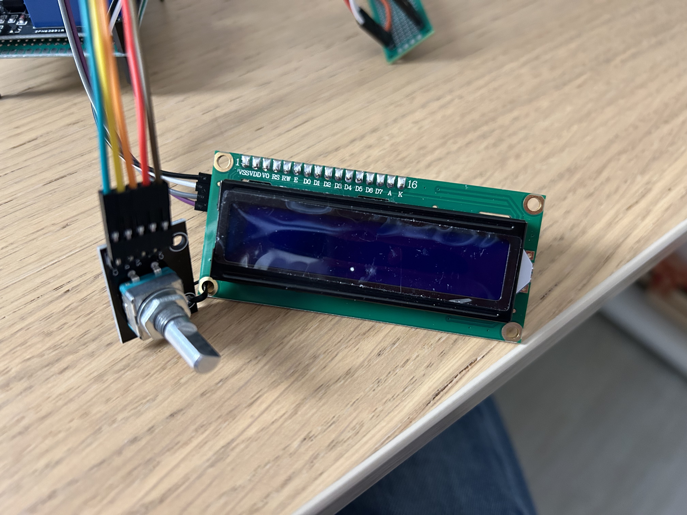

# nanoROTOR

A minimal ArduinoNano-based replacement for the control unit of a antenna rotor (AR-302).
Work in progress. Contact [@meekeee](https://www.github.com/meekeee) in case of questions.

## Authors

- Bruno (iv3kyq, not on GitHub)
- [@mgiugliano](https://www.github.com/mgiugliano)

## Features
- stand-alone control unit with LCD display and basic GUI
- no discrete components, only cheap modules (~25 eur)
- open-loop rotor control by two relays
- uses EEPROM to store/recover the last position 
- 'going home' function (i.e. position = 0 degree)
- manual control and "zeroing" for further calibration

## Components
- AZ-Delivery Nano V3 (AZDelivery, 9.99eur [amazon](https://www.amazon.it/dp/B01LWSJBTD?psc=1&ref=ppx_yo2ov_dt_b_product_details))
- KY-040 rotary encoder (AZDelivery, 11.29eur [amazon](https://www.amazon.it/dp/B079H3C98M?psc=1&ref=ppx_yo2ov_dt_b_product_details))
- Relay module 5V, 2 channels with optocoupler (AZDelivery, 15.49eur [amazon](https://www.amazon.it/dp/B07LB2RQYP?psc=1&ref=ppx_yo2ov_dt_b_product_details))
- HD44780 1602 LCD 2x16 LCD display module (AZDelivery, 11.99eur [amazon](https://www.amazon.it/dp/B082166FCL?psc=1&ref=ppx_yo2ov_dt_b_product_details))
- I2C Serial Adapter Interface (AZDelivery, 9.99eur [amazon](https://www.amazon.it/dp/B078SVXZHN?psc=1&ref=ppx_yo2ov_dt_b_product_details)) 

Links to Amazon are NOT "affiliated/sponsored". We have been appreciating the quality of AZ Delivery's product,
but we are NOT associated to/affiliated with/sponsored by them.

## Acknowledgments  

We have been inspired by Giovanni [iw1cgw](https://iw1cgw.wordpress.com/2015/02/06/control-box-per-antenna/)'s project,
whose (Arduino?) source code we could unfortunately not find online and therefore re-engineered from scratch.

## Diagram and photos

